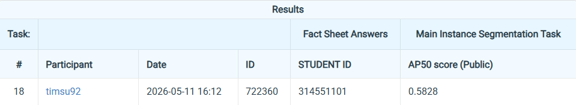

# NYCU Computer Vision 2026 HW3

- Student ID: 314551101
- Name: 蘇胤翔

## Introduction

ResNet101-FPN Mask R-CNN with CBAM attention for medical cell instance segmentation. Trained on 209 images with 4 cell types (class1–class4). Addresses severe class imbalance (class1/2: ~15K instances each; class3/4: ~600 each), tiny instances (class2 median √area ≈ 19 px), and variable image sizes (81–1956 px height).

**Final Results**: Val AP₅₀ = 0.7805 · Leaderboard AP₅₀ = 0.5828

## Environment Setup

### Prerequisites
- Python 3.11+, [uv](https://github.com/astral-sh/uv), CUDA 12+

### Installation
```bash
uv sync --locked
```

## Usage

### Training
```bash
uv run torchrun --nproc_per_node=1 -m src.train --grad-checkpoint --cbam
```

### Inference
```bash
uv run python -m src.inference --checkpoint checkpoints/20260511T071433Z/best_model.pth --output test-results.json
```

## Performance Snapshot

| Model | Val AP₅₀ | Leaderboard AP₅₀ |
|---|---|---|
| Baseline | 0.6997 | 0.4958 |
| + Augmentation & Resolution | 0.7599 | 0.5675 |
| + CBAM (layer3+4) | **0.7805** | **0.5828** |

Public score on CodaBench leaderboard as of 2026-05-12

